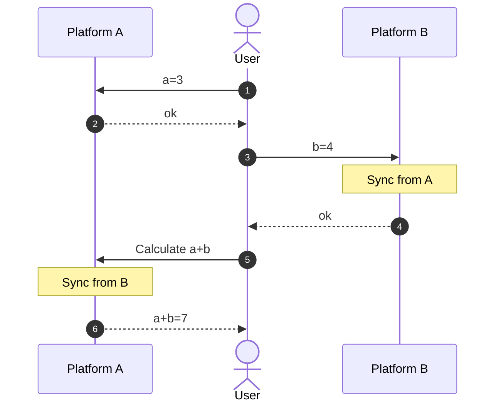

# astrbot_plugin_conversation_sync

AstrBot 对话同步插件。在多个对话间同步历史记录，适用于将 bot 作为个人助理，并希望通过不同消息平台访问时保持上下文一致。

发现没有相关功能的插件，因此手搓了一个。实现方式很灵车且未经充分测试，请注意使用风险。

其工作原理如下：

- 发送消息时，标记当前对话为 `last_active`
- 收到消息时，使用 `last_active` 的历史记录**覆盖**本地记录，并标记当前对话为 `last_active`
- 仅会响应私聊消息

## 使用例

## 配置

CID，即 Conversation ID，你可以在 `更多功能/对话数据` 中找到，形式为一串 uuid 格式的文本。

## 风险声明

使用本插件可能导致已有对话记录发生不可逆的丢失，请做好备份或创建新对话尝试。

本插件与子代理、未来任务等功能联动可能会产生非预期的行为，未测试。

# Supports

- [AstrBot Repo](https://github.com/AstrBotDevs/AstrBot)
- [AstrBot Plugin Development Docs (Chinese)](https://docs.astrbot.app/dev/star/plugin-new.html)
- [AstrBot Plugin Development Docs (English)](https://docs.astrbot.app/en/dev/star/plugin-new.html)
